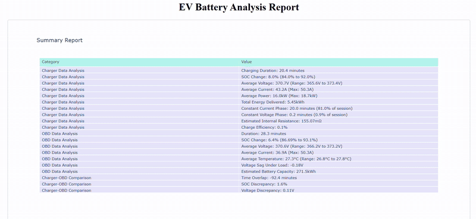

# EV Battery Data Analysis Tool

 <!-- Replace with your actual GIF path -->

A comprehensive Python tool for analyzing electric vehicle battery data from charger and OBD sources, with interactive visualization capabilities.

## Features

- **Data Loading**: Supports loading charger and OBD data from CSV files
- **Comprehensive Analysis**:
  - Charging session metrics (duration, SOC change, power, etc.)
  - Battery health indicators (internal resistance, voltage sag, etc.)
  - Charging phase detection (CC/CV)
- **Interactive Visualization**: Plotly-powered interactive charts
- **Unified Report**: Single HTML output with all analysis results and visualizations

## Installation

1. Clone the repository:
```bash
git clone https://github.com/gueni/ev-battery-analysis-tool.git
cd ev-battery-analysis-tool
```
Install required dependencies:

```bash
pip install -r requirements.txt
```

Usage

```bash
from ev_battery_analyzer import EVBatteryAnalyzer

# Initialize with your data files
analyzer    = EVBatteryAnalyzer(
    charger_file    ="path/to/charger_data.csv",
    obd_file        ="path/to/obd_data.csv"
)

# Perform analysis
analyzer.analyze_data()

# Save combined report
analyzer.save_combined_report(output_dir="results")
```

## Example Output

The tool generates a comprehensive HTML report containing:

- Summary statistics and battery health assessment

- Interactive time-series plots of voltage, current, and SOC

- Power consumption charts

- Voltage-current characteristics

- Comparison plots (when both charger and OBD data are available)

## Data Format Requirements
### Charger Data CSV should contain:
- datetime or timestamp column

- voltage (in volts)

- current (in amps)

- soc (state of charge in percent)

### OBD Data CSV should contain:
- datetime or timestamp column

- voltage (in volts)

- current (in amps)

- soc (state of charge in percent)

- (Optional) temperature (in °C)

## Contributing
Contributions are welcome! Please open an issue or submit a pull request for any improvements.

## License

MIT License